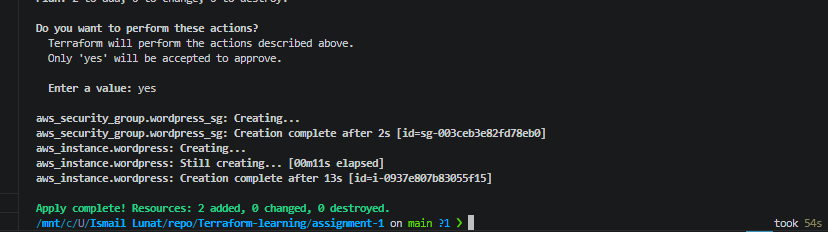
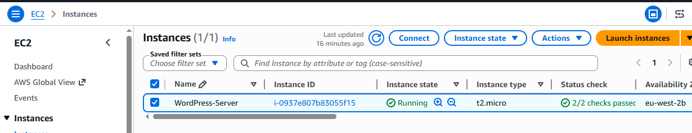
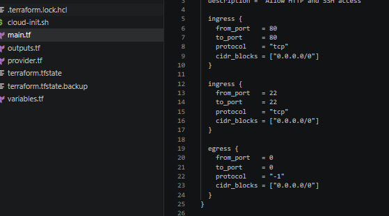
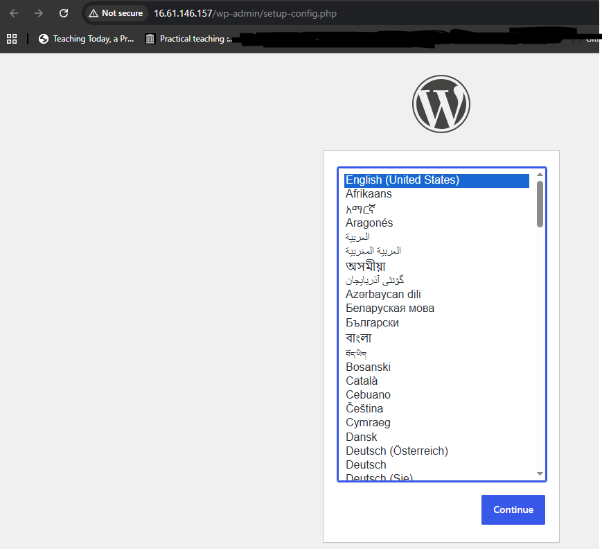

# Assignment 1 – WordPress Deployment Using Terraform on AWS

## Overview

This project demonstrates how Infrastructure as Code (IaC) can be used with Terraform to deploy a fully working WordPress website on AWS. The goal of this assignment was to automate the creation of cloud infrastructure rather than manually configuring resources through the AWS console.

Using Terraform, an EC2 instance was provisioned, networking rules were configured using a security group, and a user data script was used to automatically install and configure WordPress on launch.

The end result is a publicly accessible WordPress website running on an AWS EC2 instance.

## What this project builds

This deployment automatically creates:
- EC2 instance (Ubuntu, t2.micro)
- Security group allowing HTTP (80) and SSH (22)
- Public IP address for web access
- Automated WordPress installation using user data

Once deployed, the server becomes accessible via a browser using its public IP address.

## How Terraform was used

Terraform was used to define all infrastructure in code.

The AWS provider was configured for the eu-west-2 (London) region. The EC2 instance was created using an Ubuntu AMI, and a security group was attached to control inbound traffic.

A user data script was used to install:
- Apache web server
- MySQL database
- PHP dependencies
- WordPress

This ensured the server was fully operational after deployment.

## Key files in this project

- provider.tf - AWS provider configuration
- main.tf - EC2 instance + security group
- variables.tf - configurable inputs
- outputs.tf - public IP output
- cloud-init.sh - automated WordPress setup
- screenshots/ - evidence of work

## Deployment process

Terraform was used in three steps:
First, the working directory was initialised:
terraform init

Next, the execution plan was reviewed:
terraform plan

Finally, the infrastructure was deployed:
terraform apply

## Screenshots

Terraform apply success shows successful provisioning:

EC2 instance running confirms the server is active:

Security group rules confirm correct network access:

WordPress site confirms successful deployment:

## Issue encountered and fix

The WordPress site initially did not load because the browser tried to use HTTPS instead of HTTP. Since SSL was not configured, the connection failed. Manually switching to HTTP resolved the issue.

## Key learning outcomes

This project developed understanding of Terraform, AWS EC2 provisioning, security groups, automated server configuration, and debugging cloud deployment issues. It also reinforced Infrastructure as Code principles such as automation, repeatability, and version-controlled infrastructure.
