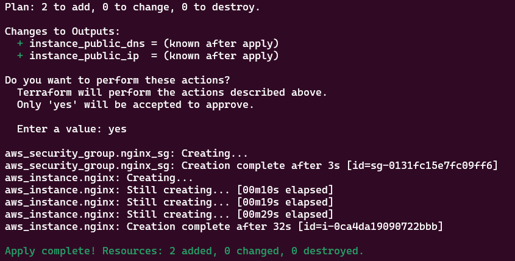
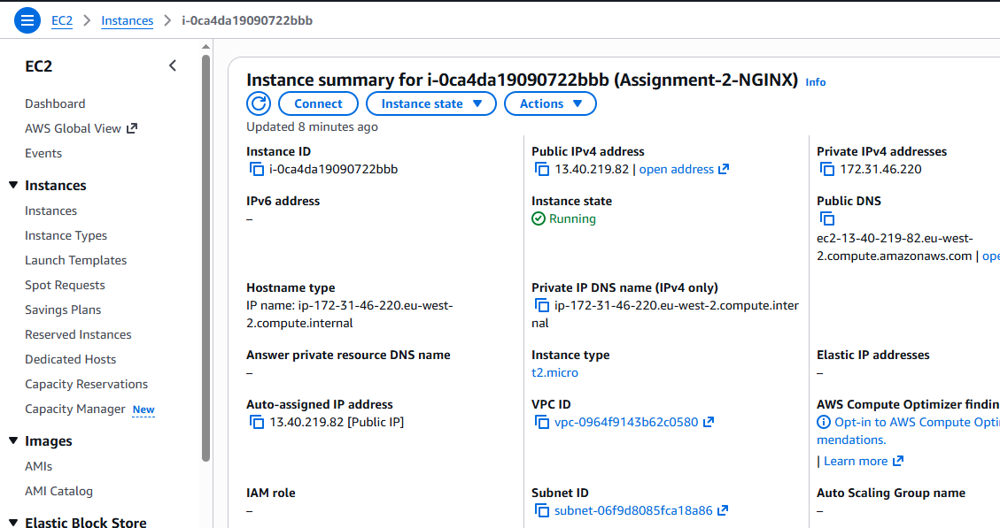
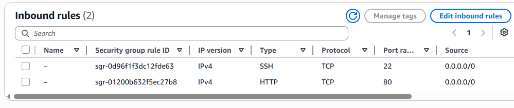
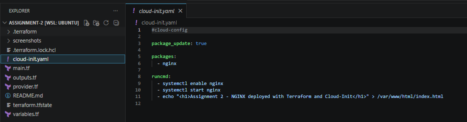
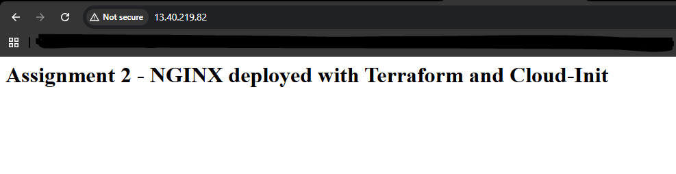
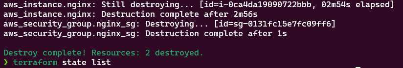

# Assignment 2 – EC2 Deployment with Cloud-Init Using Terraform

## Overview

This project demonstrates how Terraform and cloud-init can be used together to fully automate the provisioning and configuration of an EC2 instance on AWS.

The aim of this assignment was to deploy an EC2 instance and automatically install and configure NGINX on first boot using a cloud-init YAML file. This removes the need for any manual configuration after deployment.

The final result is a fully working web server deployed using Infrastructure as Code.

---

## Project structure

- provider.tf > AWS provider configuration (eu-west-2 region)
- main.tf > EC2 instance and security group definitions
- variables.tf > Input variables (AMI ID, instance type)
- outputs.tf > Outputs including public IP
- cloud-init.yaml > Automated configuration script for the server
- screenshots/ > Evidence of deployment steps
- README.md > Project documentation

---

## Step 1 – Terraform Apply (Deployment Execution)

The infrastructure is deployed to AWS using Terraform.

terraform apply

This confirms:
- EC2 instance created
- Security group created
- Cloud-init executed on launch

---

## Step 2 – Verify EC2 Instance Running

After deployment, the EC2 instance is checked in AWS to ensure it is running.

This confirms:
- Instance is in running state
- Public IP has been assigned
- Instance is accessible

---

## Step 3 – Security Group Configuration

The security group is reviewed to ensure correct inbound rules are applied.

This confirms:
- SSH (22) is open
- HTTP (80) is open
- Instance is publicly accessible

---

## Step 4 – Cloud-init Configuration

The cloud-init file used to automate installation is shown below.

This ensures:
- NGINX installs automatically
- Service starts on boot
- Custom web page is deployed

---

## Step 5 – Verify NGINX Website

The deployed application is tested in a browser using the EC2 public IP.

This confirms:
- NGINX is running correctly
- Cloud-init executed successfully
- Website is publicly accessible

---

## Step 6 – Terraform Destroy (Cleanup)

All infrastructure is destroyed using Terraform to avoid ongoing AWS costs.

terraform destroy

This confirms:
- EC2 instance terminated
- Security group removed
- No AWS resources remain active

---

## Key learning outcomes

- Terraform automates infrastructure provisioning
- Cloud-init configures servers at boot
- Security groups control network access
- Infrastructure is reproducible and version controlled
- Full lifecycle management (create → deploy → destroy)

---

## Summary

This project successfully demonstrates a fully automated EC2 deployment using Terraform and cloud-init with no manual configuration required.
